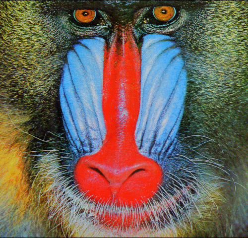

# ESPCN

The code of this example is modified from [yjn870/ESPCN-pytorch](https://github.com/yjn870/ESPCN-pytorch). Much of the credit goes to [yjn870](https://github.com/yjn870).

<details>
<summary>Original README</summary>

This repository is implementation of the ["Real-Time Single Image and Video Super-Resolution Using an Efficient Sub-Pixel Convolutional Neural Network"](https://arxiv.org/abs/1609.05158).

<center></center>

## Requirements

- PyTorch 1.0.0
- Numpy 1.15.4
- Pillow 5.4.1
- h5py 2.8.0
- tqdm 4.30.0

## Train

The 91-image, Set5 dataset converted to HDF5 can be downloaded from the links below.

| Dataset | Scale | Type | Link |
|---------|-------|------|------|
| 91-image | 3 | Train | [Download](https://www.dropbox.com/s/4mv1v4qfjo17zg3/91-image_x3.h5?dl=0) |
| Set5 | 3 | Eval | [Download](https://www.dropbox.com/s/9qlb94in1iqh6nf/Set5_x3.h5?dl=0) |

Otherwise, you can use `prepare.py` to create custom dataset.

```bash
python train.py --train-file "BLAH_BLAH/91-image_x3.h5" \
                --eval-file "BLAH_BLAH/Set5_x3.h5" \
                --outputs-dir "BLAH_BLAH/outputs" \
                --scale 3 \
                --lr 1e-3 \
                --batch-size 16 \
                --num-epochs 200 \
                --num-workers 8 \
                --seed 123                
```

## Test

Pre-trained weights can be downloaded from the links below.

| Model | Scale | Link |
|-------|-------|------|
| ESPCN (91) | 3 | [Download](https://www.dropbox.com/s/2fl5jz5nw9oiw1f/espcn_x3.pth?dl=0) |

The results are stored in the same path as the query image.

```bash
python test.py --weights-file "BLAH_BLAH/espcn_x3.pth" \
               --image-file "data/butterfly_GT.bmp" \
               --scale 3
```

## Results

PSNR was calculated on the Y channel.

### Set5

| Eval. Mat | Scale | Paper (91) | Ours (91) |
|-----------|-------|-------|-----------------|
| PSNR | 3 | 32.55 | 32.88 |

<table>
    <tr>
        <td><center>Original</center></td>
        <td><center>BICUBIC x3</center></td>
        <td><center>ESPCN x3 (23.84 dB)</center></td>
    </tr>
    <tr>
    	<td>
    		<center></center>
    	</td>
    	<td>
    		<center></center>
    	</td>
    	<td>
    		<center></center>
    	</td>
    </tr>
    <tr>
        <td><center>Original</center></td>
        <td><center>BICUBIC x3</center></td>
        <td><center>ESPCN x3 (25.32 dB)</center></td>
    </tr>
    <tr>
    	<td>
    		<center></center>
    	</td>
    	<td>
    		<center></center>
    	</td>
    	<td>
    		<center></center>
    	</td>
    </tr>  
</table>


</details>

<br/>


The following command can be run to train the model, where the train mode is the command line argument to specify train schedules of quantization and pruning.  We maintain all hyper parameters to be identical to the original repo. 

```bash
# please check "Original README" for the download urls of 
# dataset files: 91-image_x3.h5 and data/Set5_x3.h5

python3 train.py --train-file data/91-image_x3.h5  --eval-file data/Set5_x3.h5  \
    --scale 3  --lr 1e-3 --batch-size 16  --num-epochs 200  --num-workers 8  --train-mode <train mode>
```


| Training Schedule | Train Mode |  PSNR |
| --- | --- | --- |
| Baseline | `float` |  32.84 |
|  | `quantize` | 32.68|
|  | `prune_weight-quantize` | 32.51 |
|  | `quantize-prune_weight` | 32.54 |
|  | `prune_both-quantize` | 31.03 |
|  | `quantize-prune_both` | 31.66 |


## Note

We observe an increase on the variance of training result when activation pruning is applied. Therefore, for each experiment, we run five times and report the average value in the above table.


Since the size of images used during testing is larger than those in training, we set the `strict` parameter to `False` for pruning operator. This option is explained with details in [Change input sizes during evaluation](https://qsparse.readthedocs.io/en/latest/advanced_usage/#change-input-sizes-during-evaluation). 


 denotes the "prune-then-quantize" schedule on both activations and weights. The same rule applies to others.